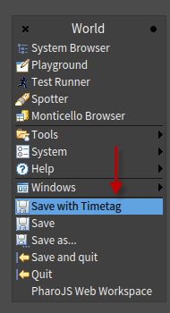

# HOImageSaver
Save your image with a time tag with ease

I like to save my images with a timetag so that I can recover from image freezes and other stupid mistakes I do.
But editing the name in the file dialog got on my nerves, so I wrote this utility.

This package allows one to save an image with the format Prefix-YYYYMMDD_HHMM.image

The image must first be saved so as the thing looks for the '-' to complete.




The class side of `HOImageSave` issues a `World resetMenu` to add the entry.

```Smalltalk
Metacello new
    githubUser: 'pharophile' project: 'HOSImageSaver' commitish: 'master' path: 'packages';
    baseline: 'HOImageSaver';
    onWarningLog;
    load
```
